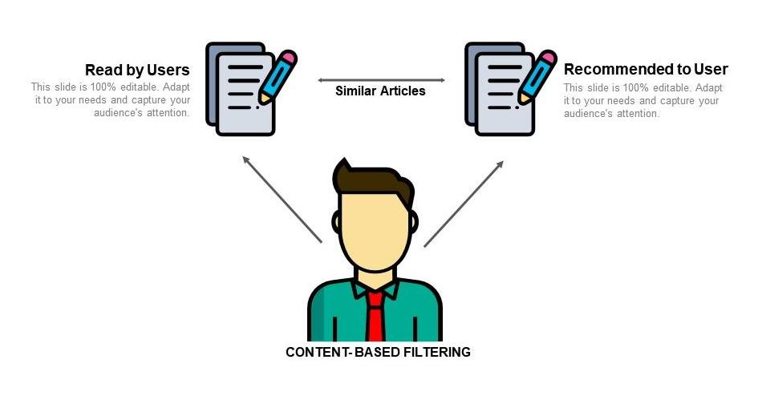

# Content Based Recommendation Engine

   

Content-based recommendation systems recommend items to a user by using the similarity of items. This recommender system recommends products or items based on their description or features. It identifies the similarity between the products based on their descriptions. It also considers the user's previous history in order to recommend a similar product.
